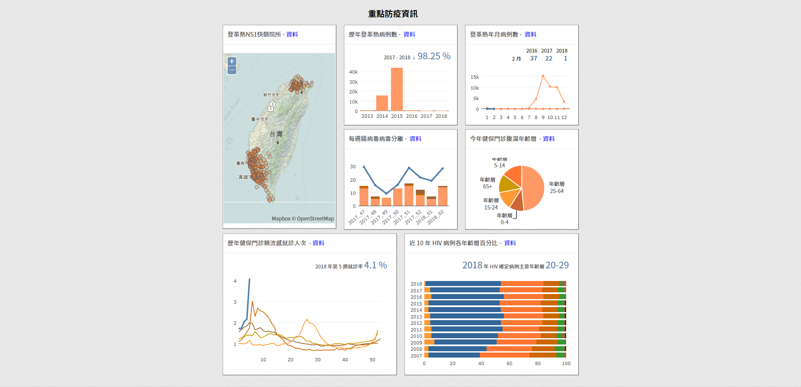

# Taiwan CDC Open Data Visualization API (Nodejs-Redis-API)


The origin opendata api (php-mysql-based, refer to [tcdc_opendataapi_php](https://github.com/jiankaiwang/tcdc_opendataapi_php)) is not proper under large amount of sessions in quite short term. The cache-based api is necessary. The repository is the **advanced** API for the visualization charts on Taiwan CDC open data portal (the following image). The visualization api consists of two types, php-mysql-based and nodejs-redis-based ones. The php-mysql-based api is accessed over http/https on port 80/443. The nodejs-redis-based api is accessed over http/https on port 8080/8080. The nodejs-redis-based api is directly accessing the redis cached database which is updated by a task scheduler generating the data ([jiankaiwang/tcdc_opendataapi_nodejs_redis](https://github.com/jiankaiwang/tcdc_opendataapi_nodejs_redis)).

All the api is designed as the **GET** operation and the content type is **application/json**.




## Step

* Install **Redis** and set up password.
* Install **Node.js**.
* Git clone the repository.

```shell
$ cd ~
$ git clone https://github.com/jiankaiwang/tcdc_opendataapi_nodejs.git
```

* Install necessary package.

```shell
$ npm install
```

* Edit the **app.js**.

```javascript
/*
 * desc : open http / https server
 * edit the http or https port
 */
var port = { "http" : 8080, "https" : 8080 }
, allowService = { "http" : false, "https" : true };

if ( allowService["http"] ) {
  http.createServer(app).listen(port["http"], function(){
    console.log('http listening on port ' + port["http"]);
  });
}

if ( allowService["https"] ) {
  var options = {
    key: fs.readFileSync('/etc/letsencrypt/live/example.com/privkey.pem'),
    cert: fs.readFileSync('/etc/letsencrypt/live/example.com/cert.pem'),
    ca: fs.readFileSync('/etc/letsencrypt/live/example.com/chain.pem')
  };

  https.createServer(options, app).listen(port["https"], function(){
    console.log('https listening on port ' + port["https"]);
  });
}
```

* Edit the **opendataplatform.js** (under **routes\opendataplatform.js**).

```javascript
/*
 * set the available service and its parameters
 * for example: https://od.cdc.gov.tw/(opendataplatform)/?s=(dengue)&v=(a1)
 * () means the information filled in apiService
 */
var apiService = {
	 "dengue" : ["a1", "a2"],
	 "influlinechart" : ["a1"],
	 "enterovirus" : ["a1"],
	 "hivbc" : ["a1"],
	 "diarrheapiechart" : ["a1"]
  };

/*
 * set the redis server connection information
 */
var __redisInfo = {
	"host" : "host",
	"port" : "port",
	"pwd" : "password"
};
```

* Establish the service.

```shell
$ sudo vim /etc/systemd/system/odredisapi.service
```

```ini
[Unit]
Description=OpenData API Service in Redis
After=network.target

[Service]
User=root
Group=root
ExecStart=/usr/bin/node /home/user/tcdc_opendataapi_nodejs/app.js > /var/tmp/odredisapi.log & 2>&1
Restart=always
Environment=PATH=/usr/bin:/usr/local/bin
Environment=NODE_ENV=production
WorkingDirectory=/home/user/tcdc_opendataapi_nodejs

[Install]
WantedBy=multi-user.target
```

```shell
# start the service
$ sudo systemctl start odredisapi.service

# check the service status
$ sudo systemctl status odredisapi.service

# automatically start service
$ sudo systemctl enable odredisapi.service
```


## Access the API

* Surf the link.

```http
<!-- all api is designed as the GET operation -->

<!-- dengue open data api -->
GET http(s)://example.com:8080/opendataplatform/?s=dengue&v=a1
GET http(s)://example.com:8080/opendataplatform/?s=dengue&v=a2

<!-- enterovirus open data api -->
GET http(s)://example.com:8080/opendataplatform/?s=enterovirus&v=a1

<!-- diarrhea open data api -->
GET http(s)://example.com:8080/opendataplatform/?s=diarrheapiechart&v=a1

<!-- influ open data api -->
GET http(s)://example.com:8080/opendataplatform/?s=influlinechart&v=a1

<!-- hiv open data api -->
GET http(s)://example.com:8080/opendataplatform/?s=hivbc&v=a1
```